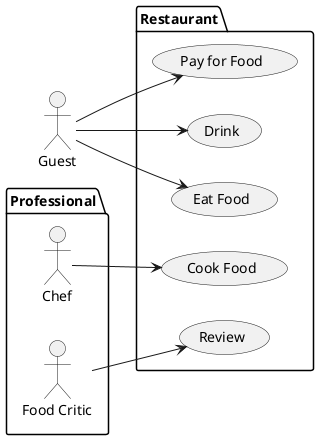

# Student information system - Scheduling

This system module is intended to be used for creating, modifying and viewing
university schedules.

Module `Scheduling` will be integrated into a larger system with other modules
(such as `Students`, `Enrollment`, `Exams`, `Surveys` and `Theses`) will perform
only tasks specific for scheduling.

## Definitions

`Subject` is a system entity, which identifies educational subject (such
as Combinatorics, Mathematical analysis, etc.).

`Room` is an entity, which describes and identifies physical room in the
university building.

`Schedule sheet` is a virtual placeholder with unique identifier, which
identifies a pair of subject and student capacity, ex. 0x654494 <->
(Mathematical Analysis 1, 24). These entities are created based on estimated
students' interest.

`Schedule triple` is any (schedule sheet, room, time span) triple, where time
span contains two time stamps symbolizing start and finish of an event.

`Schedule` is a finite set of schedule triples. A schedule is considered as
invalid if there is a pair of triples with overlapping time spans. Otherwise,
the schedule is considered as valid.

`Central schedule` is a valid schedule is being created for the upcoming
semester by a `planner`.

`Student schedule` is a valid or invalid schedule for the upcoming semester
formed by a `student`.

`Standard operations` on a system entity are creating, modifying, removing
and viewing.

## Functional Requirements

This section specifies the functional requirements.

Requirements are divided on two parts, user and system. User requirements
cover users' imminent needs and wishes. Subsequent system requirements discuss
previously introduced in greater detail and also cover constraints arisen from
the problem domain.

Certain requirements repeatedly appear in different contexts. For instance,
the ability to create and modify subject is a user requirement as well as
ability of an actor `planner`.

### User requirements

An entity of any schedule is an interconnection of two
notions scheduling sheet and room by time span.
Schedules will be constructed from set of selected
subjects. Constructed schedules could be modified under specific circumstances.

In the next subchapter, we focus on user requirements. This will help us to
identify detailed system requirements, which are imposed by the project
constraints (budget, time and people resources) and problem domain.

In the chapter after, we specify system requirements in greater details.
Then, we identify actors within the system and describe their typical use cases.

We assume,
that some kind of user entities already exist. As an example, students are
created in module `Students` and their profiles must be integrated within
module `Scheduling`.

A student could enroll in additional subjects of choice even thhough conflicts
arise.
---

We further list user requirements with intention to identify detailed system
requirements and actors. Each item of the list may be read as "The system should
provide ability to..."

- 
- Perform standard operations on subjects, rooms and timetables.
- 
- View constructed schedule by  semester, month and week.
- Extend constructed schedule with additional schedule sheets

- Import constructed schedule

### System requirements

We use approach similar to the previous chapter, group and list requirements
based on semantics and meaning. We assume, that the module user is a `root`
profile or has been authorized via central authorization module before
accessing it.

**User interface**

- Provide modern web interface with all functionality necessary for the
  operation.

**Administration**

- Restart and shut down the `Scheduling` module.

- Perform standard operations on user profiles.

- Modify profile system role. Administrator role can assign roles to other
  profiles. The module is initialized with one `root` administrator profile.

- Interconnect `Scheduling` profiles with profiles from central record module.

**User activities**

TBA

**Planning**

TBA

#### Actors

We define several kinds of actors: administrator, guest, student, teacher and
planner.

##### Actor: Administrator

TBA

##### Actor: Guest

Guest is an actor with limited abilities listed below.

- Viewing subjects.

##### Actor: Planner

`Planner` is an actor with the abilities listed below.

- Perform standard operations on a subject. By modifying a subject we mean
  updating description, sylabus, amount of e-credits, guarantor, etc.

- Perform standard operations on a 

- Create and modify central schedule for the current semester.

##### Actor: Student

`Student` is an actor with the abilities listed below.

- View all available subjects, filter and group them by a criterion selected
  from available information.

- Enroll and cancel enrollment in a particular `Schedule sheet`.

##### Actor: Teacher

`Teacher` is an actor with the abilities listed below.

- Add time spans of unavailability

- View central schedule, filter by different selectors.

#### Use cases

[*Document here all use cases. Create a subsection for each use case diagram. If you have only one use case diagram, you do not need a special subsection*]

##### [*Use case diagram title*]

[*Use case diagram in PlantUML*]

To be able to embed PlantUML diagrams to Markdown code with previews in VSCode you need
* Markdown All in One extension
* PlantUML extension
* Markdown Plantuml Preview extension

Follow https://plantuml.com/

[*Describe the diagram in a short paragraph. Describe each use case from the diagram in the detail from the lecture in a separate subsection.*]

###### [*Use case title*]

[*Use case description in the structure from the lecture.*]
