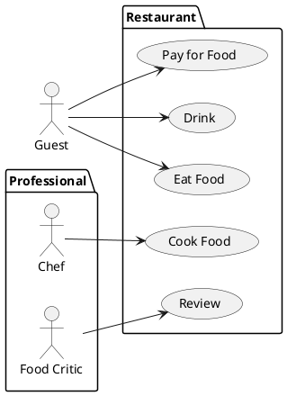

# Student information system - Scheduling

This system module is intended to be used for creating, modifying and viewing
university schedules.

Module `Scheduling` will be integrated into a larger system with other modules
(such as `Students`, `Enrollment`, `Exams`, `Surveys` and `Theses`) will perform
only tasks specific for scheduling.

## Definitions

`Subject` is a system entity, which identifies educational subject (such
as Combinatorics, Mathematical analysis, etc.).

`Room` is an entity, which describes and identifies physical room.

`Schedule sheet` is a virtual placeholder with unique identifier, which
interconnects a subject and student capacity. These entities are created based
on estimated interest of the students.

`Schedule` is a finite set of triples (timetable, room, time span). A schedule
is considered as invalid if there is a triple with overlapping time spans.
Otherwise, the schedule is considered as valid.

`Standard operations` on a system entity are creating, modifying, removing and viewing.

## Functional Requirements

This section specifies the functional requirements.

Requirements are divided on two parts, user and system. User requirements
cover users' imminent needs and wishes. Subsequent system requirements
discuss previously introduced in greater detail and also cover constraints
arisen from the problem domain.

### User requirements

TODO...

An entity of any schedule is an interconnection of two
notions scheduling sheet and room by time span.
Schedules will be constructed from set of selected
subjects. Constructed schedules could be modified under specific circumstances.

In the next subchapter, we focus on user requirements. This will help us to
identify detailed system requirements, which are imposed by the project
constraints (budget, time and people resources) and problem domain.

In the chapter after, we specify system requirements in greater details.
Then, we identify actors within the system and describe their typical use cases.

We assume,
that some kind of user entities already exist. As an example, students are
created in module `Students` and their profiles must be integrated within
module `Scheduling`.

A student could enroll in additional subjects of choice if no conflicts arise.
---

We further list user requirements with intention to identify detailed system
requirements and actors. Each item of the list may be read as "The system should
provide ability to..."

- Perform standard operations on subjects, rooms and timetables.
- 
- View constructed schedule by  semester, month and week.
- Extend constructed schedule with additional schedule sheets

- Import constructed schedule

### System requirements

We use approach similar to the previous chapter.

- Import vital information about existing profiles from central record module.
- Enrich imported profiles by `Scheduling` metadata (role, etc.)

- 
- The system provides modern web interface with all functionality necessary for
the operation.

- A valid schedule spans standard semester, either winter or summer.

- 

- 

- Verify if timetable 

- 

#### Actors

We define several kinds of actors: administrator, guest, student, teacher and
planner.

[*Document here all actors from the use case diagrams. Make a subsection for each actor and their short description in each subsection.*]

##### Actor: Administrator

##### Actor: Guest

Guest is an actor with limited abilities, such as viewing subjects

##### Actor: Student

The student should be able to do the following activities.

- View all available subjects, filter and group them by a criterion selected from available metadata.
- 

##### Actor: Planner

Planner is an actor with the following abilities.

- Perform standard operations on a subject. By modifying a subject we mean to update metadata, such as description, advancement, , etc.
- Create 

#### Use cases

[*Document here all use cases. Create a subsection for each use case diagram. If you have only one use case diagram, you do not need a special subsection*]

##### [*Use case diagram title*]

[*Use case diagram in PlantUML*]

To be able to embed PlantUML diagrams to Markdown code with previews in VSCode you need
* Markdown All in One extension
* PlantUML extension
* Markdown Plantuml Preview extension

Follow https://plantuml.com/

[*Describe the diagram in a short paragraph. Describe each use case from the diagram in the detail from the lecture in a separate subsection.*]

###### [*Use case title*]

[*Use case description in the structure from the lecture.*]
