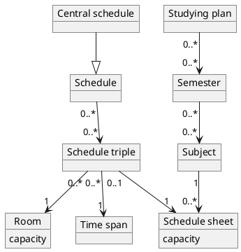
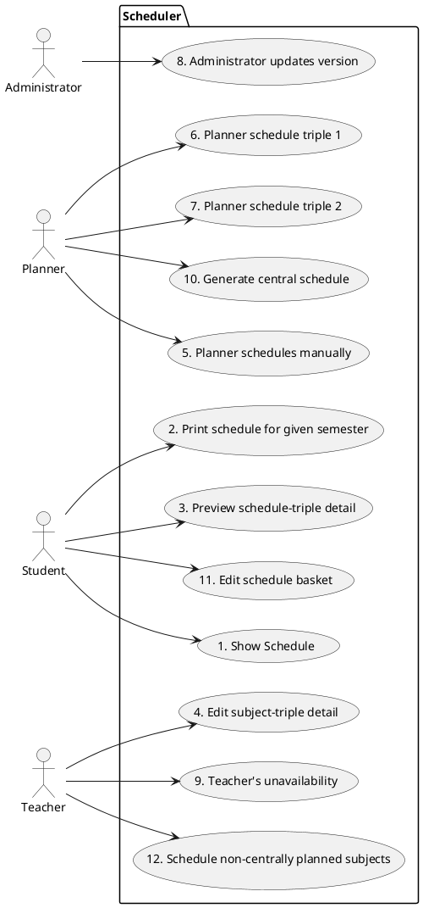
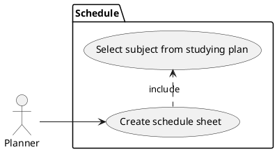
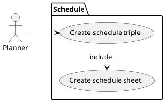
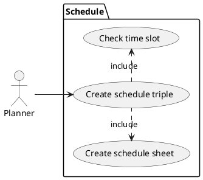
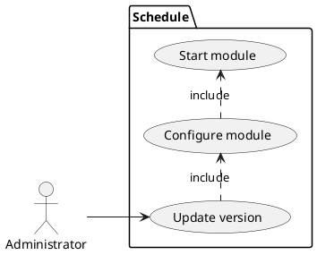
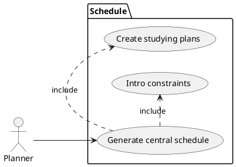
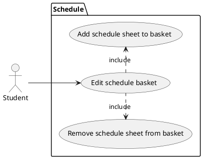
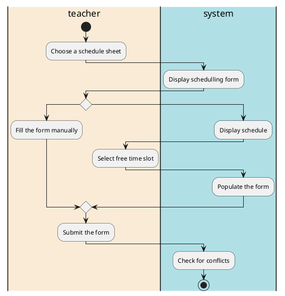

# Student information system - Scheduling

This system module is intended to be used for creating, modifying and viewing
university schedules.

Module `Scheduling` will be integrated into a larger system with other modules
(such as `Students`, `Enrollment`, `Exams`, `Surveys` and `Theses`) will
perform only tasks specific for scheduling.

## Definitions

`Subject` is a system entity, which identifies educational subject (such
as Combinatorics, Mathematical Analysis, etc.).

`Room` is an entity, which describes and identifies physical room in the
university building or virtual room in any available videotelephony software
program.

`Studying plan` is a list of mandatory subjects, that a student shall
accomplish before submitting thesis.

`Schedule sheet` is a virtual placeholder with unique identifier, which
identifies a pair of subject and student capacity, ex. id <->
(subject, capacity). These entities are created based on estimated
students' interest.

`Schedule triple` is any (schedule sheet, room, time span) triple, where time
span contains two time stamps symbolizing start and finish of an event.

`Schedule` is a finite set of schedule triples. A schedule is considered as
invalid if there is a pair of triples with overlapping time spans.

`Central schedule` is a valid schedule is being purposefully created by
a `planner` for the upcoming semester.

`Standard operations` on a system entity are creating, modifying, removing
and viewing.

The following diagram shows important objects and how they are related.

## Functional Requirements

This section specifies the functional requirements.

Requirements are divided on two parts, user and system. User requirements
cover users' imminent needs and wishes. Subsequent system requirements discuss
previously introduced in greater detail and also cover constraints arisen from
the problem domain and project constraints (budget, time and people resources).
Then, we identify actors within the system and describe their typical use cases.

Certain requirements might repeatedly appear in different contexts. For
instance, the ability to create and modify subjects is a user requirement as
well as ability of an actor `planner`.

### User requirements

We list user requirements with intention to identify detailed system
requirements and actors. Each item of the list may be read as "The system
should provide ability to..."

- Provide friendly user interface.

- Manage module resources, users and user permissions.

- Perform standard operations on `subjects`, `rooms` and `schedule sheets`.

- Create conflict-free `central schedules` based on `studying plans` and
  other constraints.

- Add constraints on `central schedules`.

- Import and view `central schedules` (weekly, monthly, etc.) and information
  about other module entities in different formats.

### System requirements

In this chapter, we specify user requirements in greater details. We use
approach similar to the previous chapter, group and list requirements based on
semantics and meaning. We assume, that the module user is a `root` profile or
has been authorized via central authorization module before accessing it.

**User interface**

- Provide modern web interface with all functionality necessary for the
  operation.

**Administration**

- Restart and shut down the `Scheduling` module.

- Enrich profiles from central record module with additional information
  associated with module `Scheduling`.

- Modify profile module role. Administrator role can assign roles to other
  profiles. The module is initialized with one `root` administrator profile.

**Planning activities**

- Perform standard operations on `subjects`. By modifying a subject we mean
  updating information (description, sylabus, amount of e-credits, guarantor,
  etc.). Subject can be recommended for a specific semester as students
  progress or `studying plan`.

- Perform standard operations on `rooms`. Room capacity shall be specified
  as a constraint for all physical rooms and might be specified for virtual
  rooms on demand.

- Perform standard operations on `studying plans` after all necessary
  `subjects` are created.

- Perform standard operations on `schedule sheets`. Total capacity for
  a particular `subject` shall reflect `studying plans` as well as estimated
  students' interest in enrolling in the subject. All `schedule sheets`
  created for the current semester must be assigned to some `schedule triple`.
  Impossibility for such assignment is a severe conflict, which prevents
  `central schedule` to be constructed.

- Create `central schedule` in automatic mode by using `schedule sheets` and
  and other constraints.

- Create and modify `central schedule` in manual mode. Manual mode assumes,
  that `schedule triples` will be created, removed or modified one-by-one.
  Correctness could be verified at any time.

- Created `schedule triples` shall ensure, that students are able to visit
  all subjects from `studying plan` planned for the current semester.

- Save created `central schedule`, remove it to start all over, release it
  to other modules and university personnel.

**Student and teacher activities**

- View available information about `subjects`, `rooms` and `schedule sheets`.

- View `central schedule` released by a planner entirely, or filtered by
  various criteria.

- Subscribe to receive e-mail notifications about changes in schedulling
  of `schedule sheets` that student is enrolled in.

**Specific student activities**

- View `studying plan` with additional information about already passed
  mandatory subjects.

- Maintain a basket of `schedule triples` for the current semester with ability
  to add, and remove them without any restrictions. A basket is used for
  constructing preliminary student schedule, actual construction happens
  within `Enrollment` module.

**Specific teacher activities**

- Introduce unavailability constraints into a prepared `central schedule`.
  Such constraints will be considered while creating `schedule triples`, but
  are not mandatory for a `planner`.

- Adjust metadata about `schedule-triples` - for example adding links for student enrolled in that triple (to third parties like moodle, one drive etc.), providing them with further instructions or information.

**Reporting activities**

- Collect and view statistics about room occupation or fulfillment of all
  `studying plans` for the current semester.

- Import the entire `central schedule` or certains parts of it in a data
  format of choice (json, csv, pdf, etc.).

#### Actors

We define several kinds of actors: administrator, planner, student and teacher.

##### Actor: Administrator

`Administrator` is an actor performing module maintenance and administrative
tasks, such as user administration, deployment of new module versions.
Synchronization with other modules is performed automatically and in a daily
basis.

##### Actor: Planner

`Planner` is an actor performing **planning activities**. In general, it is
an authority, who defines `subjects`, `rooms`, `studying plans`,
`schedule sheets` and schedules taking into account introduced constraints.

##### Actor: Student

`Student` is an actor performing **student activities**. The user can view
existing entities, but cannot modify them or intervene planning process.

##### Actor: Teacher

`Teacher` is an actor performing **teacher activities**. The user can introduce
non-mandatory constraints into planning process and can view planning entities.

#### Use cases

We define define the following use cases.

 1. Student can preview schedule.
 2. Student can export schedule to PDF.
 3. Student can open detail of schedule-triple.
 4. Teacher can edit metadata about schedule-triple.
 5. Planner can schedule subjects manually.
 6. Planner can assign schedule sheet to a schedule triple with check of room availability.
 7. Planner can assign schedule sheet to a schedule triple with check of conflicts with other compulsory subjects.
 8. Administrator updates module version.
 9. Teacher introduces unavailability constraints.
10. Planner generates `central schedule` via solver.
11. Student can edit his schedule basket.
12. Teacher can schedule non-centrally planned subjects.
The following figure is an integrated diagram containing all use cases
described in the following chapters.

##### 1. Student can preview schedule

Student can preview schedule for given semester where he/she can see all
subject triples in which he/she enrolled.

**Right**
1. Student will see a webpage containing schedule for his/her semester

**Wrong**
1. Student would see someone elses schedule.
2. There would be some enrolled triples missing.

**Result**
- 

##### 2. Student can export schedule to PDF

Student can export detailed schedule for the whole semester into PDF format - for example for printing it out on paper.

**Right**
1. PDF file will get downloaded to student's device containing the full schedule for semester.

**Wrong**
1. Student would download someone elses schedule.
2. There would be some enrolled triples missing.

**Result**
- 
##### 3. Student can open detail of schedule-triple

Student can preview detail of given schedule-triple which can contain additional information about this specific schedule-triple - for example reading some further description/instruction from teacher.

**Right**
1. Student will see a webpage containing details of given schedule-triple.

**Wrong**
1. Student would not have access to details of given schedule-tripple
2. There would be some metadata missing.

**Result**
- 

##### 4. Teacher can edit metadata about schedule-triple

Teacher can edit several metadata about schedule-triple of subject they teach - for example providing students with further instructions, links to external services (e.g. moodle, one drive) etc.

**Right**
1. Teacher will see a form for filling details about given schedule-triple.
2. Teacher will be able to fill the form and save the data.

**Wrong**
1. Teacher would not see the editing form.
2. Saving the form would fail for some reason.
3. Saving the form would succeed but data would not be saved consistently.

**Result**
- 

##### 5. Planner can create schedule sheet

Planner can create schedule sheets according to the studying plan for current term.
Planner has a subject from studying plan he needs to schedule. He fills in a capacity, thus creating schedule sheet with unique ID. Capacity of various subjects may differ, lectures will usually have greater capacity than tutorials. Schedule sheets don´t need to be scheduled immediately and may be created at any time.

**Right**
1. Planner will see all available subjects.
2. Planner will be able to choose a subject and create schedule sheet for it.

**Wrong**
1. Planner would not have access to the list of subjects or studying plan.
2. Creating of schedule sheet would fail.
3. Creating a schedule sheet would succeed, but these changes would not be reflected in the system. 

##### 6. Planner can assign schedule sheet to a schedule triple

Planner can assign schedule sheet to a schedule triple and system will automatically check availability of assigned room during specified time slot.
When schedule sheet with unique ID has been created, it can be paired with room. Room may be chosen manually (by planner) or automatically (based on capacity constraint). System will automatically check whether assigned room is available during specified time slot. If the room is not available, schedule triple will not be created.

**Right**
1. Planner can see all schedule sheets and schedule triples.
2. Planner can choose schedule sheet and assign it to time slot and room.

**Wrong**
1. Planner would not be able to see schedule sheets or schedule triples.
2. Assigning time slot and room to a schedule sheet would fail for some reason.
3. Creating of schedule triple would be successful, however, these changes would not be reflected in the system.

##### 7. Planner can assign schedule sheet to a schedule triple

Planner can assign schedule sheet to a schedule triple. There must be no conflicts among subjects taught at the same term which are compulsory according to the studying plan. System will not accept schedule triple, if it is in conflict with already registered schedule triple.

##### 8. Administrator updates module version

**Input**

The user is logged as an `administrator`. The module `Scheduling` is under
normal operation.

**Right**

1. Administrator issues a command to stop service.

2. Service releases broadcast message to other services about the matter.

3. Other services confirm, that all relations are finished and cancelled.

4. Service reports acknowledgement back to the administrator and goes down.

5. Administrator installs updated version via central repository.

6. Administrator starts new service process with previous configuration.

7. Service releases broadcast message to other services about the matter.

8. Other services respond on the message positively.

9. Service reports acknowledgement back to the administrator.

**Wrong**

1. Some of the long-lasting relations cannot be finalized, the module rejects shutdown.

2. Updated version cannot be installed due to internal errors. The entire
  module shall be uninstalled and installed from scratch.

3. Updated version of the module cannot be started due to an internal error.
  The administrator should study system log and contact support if it does
  not help.

**Result**

New version of the module is installed and under normal operation.

##### 9. Teacher introduces unavailability constraints

**Input**

The user is logged as a `teacher`. The `central schedule` is released for
introducing teachers constraints.

**Normal**

1. The user opens `central schedule` for adding constraints.

2. The user introduce a time span with two time stamps, start and finish of
  an availability.

3. The user saves introduced constraints.

**Wrong**

1. Two overlapped time spans result in a conflict. The module kindly informs
  the user, however conflict might remain unsolved.

**Output**

Planner is informed about optional teacher's unavailability.

##### 10. Planner generates `central schedule` via solver

**Input**

The user is logged as `planner`. All necessary `studying plans` and constraints
are created and set.

**Normal**

1. Planner creates empty `central schedule`.

2. Planner issue request to the `solver`.

3. Solver resolves system of constraints and returns a set of `central schedules`.

4. Planner saves the most appropriate option, which might be modified later.

**Wrong**

1. Constraints or `studying plans` cannot be satisfied, planner shall relax
  constraints or modify `studying plans`. Teacher constraints are considered
  non-mandatory.

2. Solver service exceeds timeout for responding. Planner should try to
  issue a new request or relax constraints.

**Output**

Conflict-free and modifiable `central schedule` is created.

##### 11. Student can edit his schedule basket

A student can mantain a basket of `schedule sheets` he is interested in enrolling. The basket serves as preliminary schedule and helps a student with planning a schedule for upcoming semester.
To add subject to the basket, student must search for subject in `central schedule` and open detail view. System displays a list of `schedule sheets` belonging to the subject. Then student selects the `schedule sheet` and `add to basket`. System adds it to basket. Removing schedule sheet from basket can be requested when viewing the basket.

##### 12. Teacher can schedule non-centrally planned subjects

Some elective subjects are not planned centrally, because these subjects are very specialized and a few students are expected to enroll.

The schedulling is done by assigning `schedule sheet` to `schedule triple` like the planner does.

**Input**

`Central schedule` is published and schedulling
of non-centrally planned subjects is allowed.
The user is logged in and has a `teacher` role.

**Normal**

* User chooses schedule sheet he wants to schedule.

* System displays a schedulling form for selected schedule sheet.

* User specifies room and time span for the schedule sheet
  - by manualy typing name of the room and time span into the form.
  - interactively: the system displays schedule for the semester. Schedule can be viewed by day and building. Free slots in rooms with suitable capacity will be highlighted. User selects free slot. System populates the form with selected room and time span.

* User submits the form.
* System checks for conflicts.

**Wrong**

1. The room is already occupied in specified time span.
  System notifies user, `schedule triple` is not assigned to `schedule sheet`.

2. Room does not have sufficient capacity. 
  System notifies user, `schedule triple` is not assigned to `schedule sheet`.

**Output**

`Schedule sheet` is assigned new `schedule triple`.

