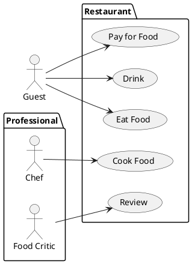

# Student information system - Scheduling

This system module is intended to be used for creating, modifying and viewing
university schedules.

Module `Scheduling` will be integrated into a larger system with other modules
(such as `Students`, `Enrollment`, `Exams`, `Surveys` and `Theses`) will
perform only tasks specific for scheduling.

## Definitions

`Subject` is a system entity, which identifies educational subject (such
as Combinatorics, Mathematical analysis, etc.).

`Room` is an entity, which describes and identifies physical room in the
university building.

`Schedule sheet` is a virtual placeholder with unique identifier, which
identifies a pair of subject and student capacity, ex. 0x654494 <->
(Mathematical Analysis 1, 24). These entities are created based on estimated
students' interest.

`Schedule triple` is any (schedule sheet, room, time span) triple, where time
span contains two time stamps symbolizing start and finish of an event.

`Schedule` is a finite set of schedule triples. A schedule is considered as
invalid if there is a pair of triples with overlapping time spans. Otherwise,
the schedule is considered as valid.

`Central schedule` is a valid schedule is being created for the upcoming
semester by a `planner`.

`Student schedule` is a valid or invalid schedule for the upcoming semester
formed by a `student`.

`Studying plan` is an identifiable list of mandatory subjects, that a student
shall accomplish before submitting thesis.

`Standard operations` on a system entity are creating, modifying, removing
and viewing.

## Functional Requirements

This section specifies the functional requirements.

Requirements are divided on two parts, user and system. User requirements
cover users' imminent needs and wishes. Subsequent system requirements discuss
previously introduced in greater detail and also cover constraints arisen from
the problem domain and project constraints (budget, time and people resources).
Then, we identify actors within the system and describe their typical use cases.

Certain requirements might repeatedly appear in different contexts. For
instance, the ability to create and modify subjects is a user requirement as
well as ability of an actor `planner`.

### User requirements

We list user requirements with intention to identify detailed system
requirements and actors. Each item of the list may be read as "The system
should provide ability to..."

- Provide friendly user interface.

- Manage system resources, users and user permissions.

- Perform standard operations on `subjects`, `rooms`, `schedule sheets`.

- Create free of conflicts `central schedules` based on `studying plans` and
  other constraints.

- Create `student schedules` by enrolling in available `schedule sheets`.

- Add constraints on `central schedules`.

- Import `student schedule` and other views in different formats.

### System requirements

In this chapter, we specify user requirements in greater details. We use
approach similar to the previous chapter, group and list requirements based on
semantics and meaning. We assume, that the module user is a `root` profile or
has been authorized via central authorization module before accessing it.

**User interface**

- Provide modern web interface with all functionality necessary for the
  operation.

**Administration**

- Restart and shut down the `Scheduling` module.

- Perform standard operations on user profiles.

- Modify profile system role. Administrator role can assign roles to other
  profiles. The module is initialized with one `root` administrator profile.

- Interconnect `Scheduling` profiles with profiles from central record module
  and synchronize imported data.

**Planning activities**

- Perform standard operations on a subject. By modifying a subject we mean
  updating information (description, sylabus, amount of e-credits, guarantor,
  etc.). A subject might be mandatory for some 

- Perform standard operations on a room. Rooms might symbolize either physical
  or virtual (zoom session) place.

- Perform standard operations on a `studying plan` after all necessary subjects
  are defined. A planner could mark subject as must-be-planned, meaning these
  subjects will be considered during automatic planning or will be highlighted
  during manual planning.

- Create `central schedule` in automatic mode by using `studying plans`,
  list of must-be-planned subjects and constraints given by the `teachers`.

- Create and modify `central schedule` in manual mode. Manual mode assumes,
  that `schedule sheets` will be created, removed or modified one-by-one.

**Student activities**

TODO ...

- Viewing information about subjects, rooms, schedule sheets and.

- List ...

- Construct `student schedule` by selecting any subjects available in the
  current semester. At this point, `central schedule` already exists.
  Enrollment is not possible if number of enrolled students exceeds the room
  capacity.

- Register in waiting list for a particular `schedule sheet` if room capacity
  exceeds. The student

- 

- Enroll in additional subjects of choice even though conflicts arise.

**Teacher activities**

- 

#### Actors

We define several kinds of actors: administrator, guest, student, teacher and
planner.

##### Actor: Administrator

`Administrator` is an actor performing module maintenance and administrative
tasks, such as user administration, deployment of new module versions.
Synchronization with other modules is performed automatically and in a daily
basis.

##### Actor: Guest

`Guest` is an unauthorized actor with limited abilities to search and view
subject information.

##### Actor: Planner

`Planner` is an actor performing **planning activities**. In general, it is
an authority, who defines subjects, rooms, studying plans, schedule sheets
and schedules taking into account constraints from teachers (unavailability).

##### Actor: Student

`Student` is an actor performing **student activities**. This is 

- View all available subjects, filter and group them by a criterion selected
  from available information.

- Enroll and cancel enrollment in a particular `Schedule sheet`.

##### Actor: Teacher

`Teacher` is an actor with the abilities listed below.

- Add time spans of unavailability

- View central schedule, filter by different selectors.

#### Use cases

[*Document here all use cases. Create a subsection for each use case diagram. If you have only one use case diagram, you do not need a special subsection*]

##### [*Use case diagram title*]

[*Use case diagram in PlantUML*]

To be able to embed PlantUML diagrams to Markdown code with previews in VSCode you need
* Markdown All in One extension
* PlantUML extension
* Markdown Plantuml Preview extension

Follow https://plantuml.com/

[*Describe the diagram in a short paragraph. Describe each use case from the diagram in the detail from the lecture in a separate subsection.*]

###### [*Use case title*]

[*Use case description in the structure from the lecture.*]
